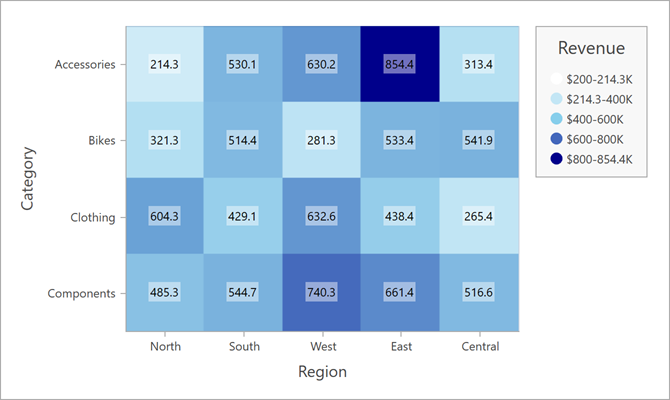

<!-- default badges list -->

<!-- default badges end -->

# How to Create a Heatmap Based on Arrays of String and Numeric Values

This example shows how to use string and numeric value arrays to create a heatmap.

To load array data to a heatmap, follow the steps below:

- Create a [HeatmapMatrixAdapter](https://docs.devexpress.com/WPF/DevExpress.Xpf.Charts.Heatmap.HeatmapMatrixAdapter?v=21.2&p=netframework) object. 

- Specify the following adapter properties:

    - [XArguments](https://docs.devexpress.com/WPF/DevExpress.Xpf.Charts.Heatmap.HeatmapMatrixAdapter.XArguments)
    - [YArguments](https://docs.devexpress.com/WPF/DevExpress.Xpf.Charts.Heatmap.HeatmapMatrixAdapter.YArguments)
    - [Values](https://docs.devexpress.com/WPF/DevExpress.Xpf.Charts.Heatmap.HeatmapMatrixAdapter.Values)

- Assign the adapter object to the [HeatmapControl.DataAdapter](https://docs.devexpress.com/WPF/DevExpress.Xpf.Charts.Heatmap.HeatmapControl.DataAdapter) property.

<!-- default file list -->
## Files to Look At

- [MainWindow.xaml](./CS/MainWindow.xaml) (VB: [MainWindow.xaml](./VB/MainWindow.xaml))
- [MainWindow.xaml.cs](./CS/MainWindow.xaml.cs) (VB: [MainWindow.xaml.vb](./VB/MainWindow.xaml.vb))

<!-- default file list end -->

## Documentation

- [HeatmapControl](https://docs.devexpress.com/WPF/DevExpress.Xpf.Charts.Heatmap.HeatmapControl)

## More Examples

- [How to Create a Heatmap Chart Based on a Data Source](https://github.com/DevExpress-Examples/wpf-heatmap-bind-to-data-source)
<!-- feedback -->
## Does this example address your development requirements/objectives?

 

(you will be redirected to DevExpress.com to submit your response)
<!-- feedback end -->
